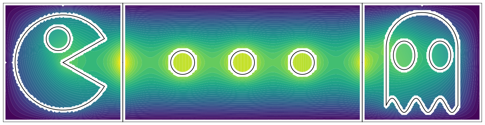

# Punctured FEM

https://github.com/samreynoldsmath/PuncturedFEM



An approximate solution to $-\Delta u + u = 1$ on a rectangle with a zero Dirichlet boundary condition.
The mesh consists of 11 cells, 5 of which are multiply connected, and all have curvilinear boundaries.
See [examples/ex2-pacman-fem.ipynb](examples/ex2-pacman-fem.ipynb).

## Description
A finite element method on meshes with curvilinear and multiply connected cells.

One might call the method a "nonvirtual virtual element method" because it uses the same function spaces as the virtual element method [1], but works with basis functions directly, rather than projecting them and introducing stabilization terms.

One advantage of our approach is the ability to find values of the basis functions (and therefore the finite element solution) in the interior of mesh cells, not just on the mesh skeleton.
However, all essential calculations (such as entries of the stiffness and mass matrices) are occur entirely on cell boundaries, using single-dimensional quadrature.

A disadvantage of our approach is that it is currently limited to planar domains. This is because we are able to exploit some results from complex analysis to compute the basis functions and their derivatives.

Given a mesh cell $K \in \mathcal{T}$, the **local Poisson space** $V_p(K)$ consists of $v \in H^1(K)$ such that:

- the Laplacian $\Delta v$ is a polynomial of degree at most $p-2$ on $K$,
- the trace $v|_{\partial K}$ on the boundary of the mesh cell is continuous, and
- the restriction $v|_{e}$ to each edge $e$ of the mesh cell is the trace a polynomial of degree at most $p$.

One may see that $V_p(K)$ contains the space of polynomials of degree at most $p$ on $K$, but is typically a much richer space.
The **global Poisson space** $V_p(\mathcal{T})$ is the space of continuous functions $v \in H^1(\Omega)$ such that $v|_K \in V_p(K)$ for all $K \in \mathcal{T}$, where $\mathcal{T}$ is a mesh of the domain $\Omega$.

A discussion of the method, including interpolation estimates, is given in [3].
A method of computing $L^2$ inner products and $H^1$ semi-inner products of functions in $V_p(K)$, with $K$ simply connected, is given in [2,4].
The multiply connected case is discussed in [5].

### Examples used in publications
- Jeffrey S. Ovall, and Samuel E. Reynolds, "Evaluation of inner products of implicitly-defined finite element functions on multiply connected planar mesh cells" [5]
  - [Example 4.1 (Punctured Square)](examples/ex1a-square-hole.ipynb)
  - [Example 4.2 (Pac-Man)](examples/ex1b-pacman.ipynb)
  - [Example 4.3 (Ghost)](examples/ex1c-ghost.ipynb)

### References
- **[1]** [L. Beiriao da Veiga, F. Brezzi, A. Cangiani, G. Manzini, L. D. Marini, and A. Russo. Basic principles of virtual element methods. *Mathematical Models and Methods in Applied Sciences*, 23(1):199–214, 2013.](http://dx.doi.org/10.1142/S0218202512500492)
- **[2]** [Jeffrey S. Ovall, and Samuel E. Reynolds. A high-order method for evaluating derivatives of harmonic functions in planar domains. *SIAM Journal on Scientific Computing* , Vol. 40(3), A1915–A1935, 2018.](https://doi.org/10.1137/17M1141825)
- **[3]** [Akash Anand, Jeffrey S. Ovall, Samuel E. Reynolds, and Steffen Weisser. Trefftz Finite Elements on Curvilinear Polygons. *SIAM Journal on Scientific Computing*, Vol. 42(2), pp. A1289–A1316, 2020.](https://doi.org/10.1137/19M1294046)
- **[4]** [Jeffrey S. Ovall, and Samuel E. Reynolds. Quadrature for Implicitly-defined Finite Element Functions on Curvilinear Polygons. *Computers & Mathematics with Applications*, Vol. 107 (1), pp. 1–16, 2022.](https://doi.org/10.1016/j.camwa.2021.12.003)
- **[5]** [Jeffrey S. Ovall, and Samuel E. Reynolds. Evaluation of inner products of implicitly-defined finite element functions on multiply connected planar mesh cells. *SIAM Journal on Scientific Computing*, Vol. 46 (1), pp. A338–A359, 2024](https://doi.org/10.1137/23M1569332)

## Installation
This package is available on [PyPI](https://pypi.org/project/puncturedfem/), and can be installed with pip:
```bash
pip install puncturedfem
```

### Dependencies
This project is written in Python 3.11 and uses the following packages:
- [matplotlib](https://matplotlib.org/) (plotting)
- [numba](https://numba.pydata.org/) (just-in-time compilation)
- [numpy](https://numpy.org/) (arrays, FFT)
- [scipy](https://www.scipy.org/) (sparse matrices, GMRES)
- [tqdm](https://tqdm.github.io/) (progress bars)

Furthermore, this repo contains examples presented with [Jupyter notebooks](https://jupyter.org/).

## Usage
- [Official documentation](https://punctrdfem.readthedocs.io/)
- [Examples](examples/)

## Contributors
- [Jeffrey S. Ovall](https://sites.google.com/pdx.edu/jeffovall) (1):
principal investigator
- [Samuel E. Reynolds](https://sites.google.com/view/samreynolds) (1):
lead developer
- [Zack Kenyon](https://github.com/zackkenyon) (1):
junior developer

### Affiliation
(1) [Fariborz Maseeh Department of Mathematics and Statistics, Portland State University](https://www.pdx.edu/math/)

## Acknowledgements


Funding for this project was provided by the National Science Foundation through:
- **NSF grant DMS-2012285**
- **NSF RTG grant DMS-2136228**

## Disclaimers
- This code is intended to serve as a prototype, and has not necessarily been optimized for performance.
- This project is under heavy development, which may result to changes in to the API. Consult the examples for the latest suggested usage.

## License
Copyright (C) 2022 - 2024, Jeffrey S. Ovall and Samuel E. Reynolds.

This program is free software: you can redistribute it and/or modify it
under the terms of the GNU General Public License as published by the Free
Software Foundation, either version 3 of the License, or (at your option)
any later version.

This program is distributed in the hope that it will be useful, but WITHOUT
ANY WARRANTY; without even the implied warranty of MERCHANTABILITY or
FITNESS FOR A PARTICULAR PURPOSE.  See the GNU General Public License for
more details.

You should have received a copy of the GNU General Public License along with
this program.  If not, see <https://www.gnu.org/licenses/>.
