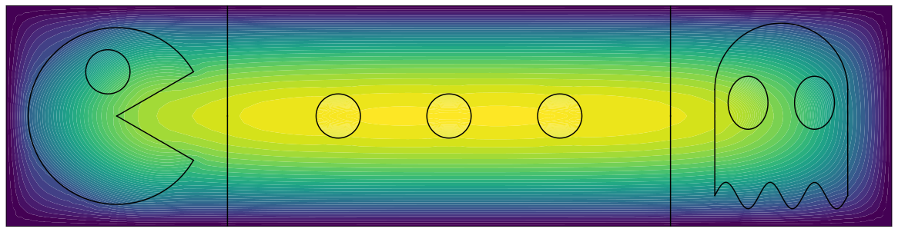

# Punctured FEM



The PuncturedFEM package is a Python package for solving partial differential equations with nonstandard meshes.

This package is still under heavy development. Check out our [roadmap](ROADMAP.md) for a list of planned features and known bugs.

## Quickstart
Install the package with pip:
```bash
pip install puncturedfem
```
Check out some of the tutorials, such as the [Pac-Man mesh](src/examples/ex2.1-pacman-fem.ipynb).

## Links
- [Documentation](https://puncturedfem.readthedocs.io)
- [Source code](https://github.com/samreynoldsmath/PuncturedFEM)
- [PyPI package](https://pypi.org/project/puncturedfem/)